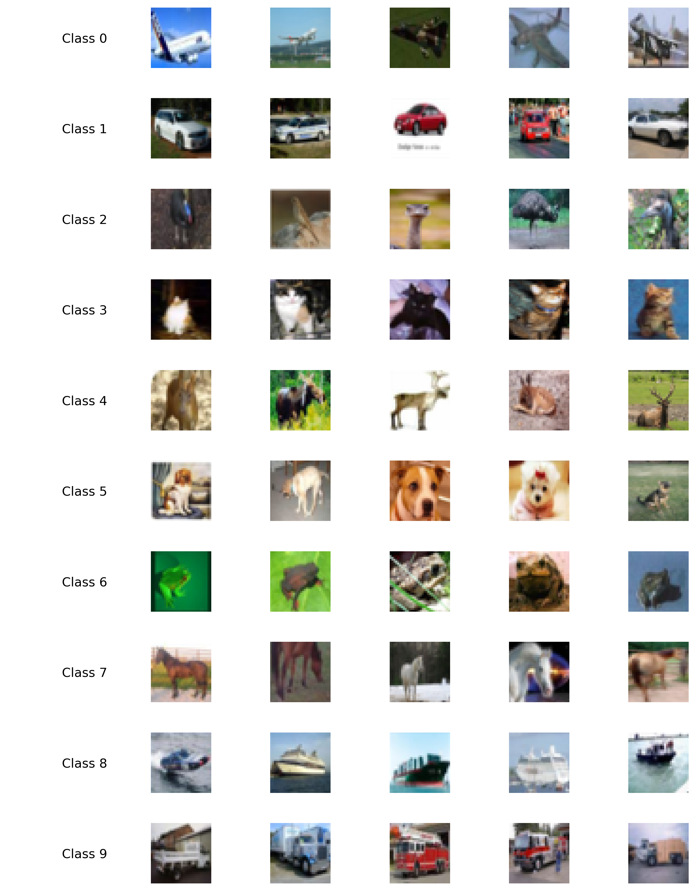
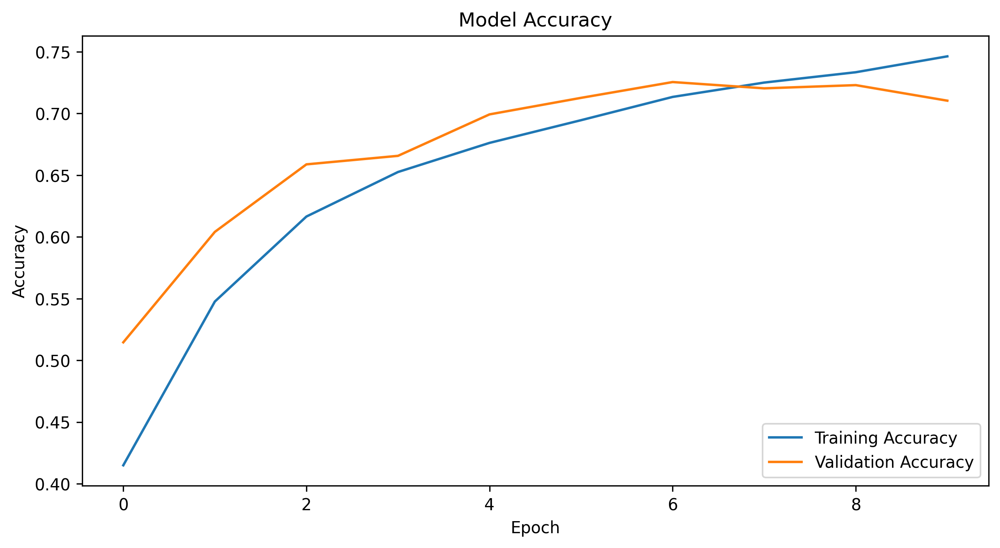
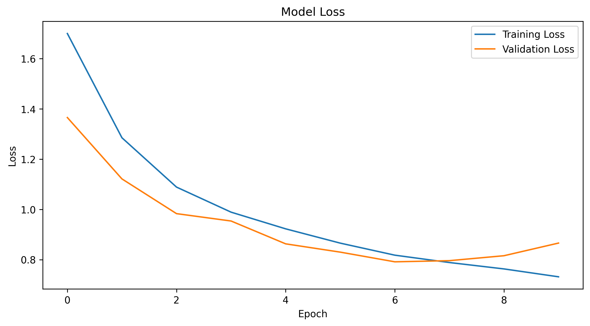
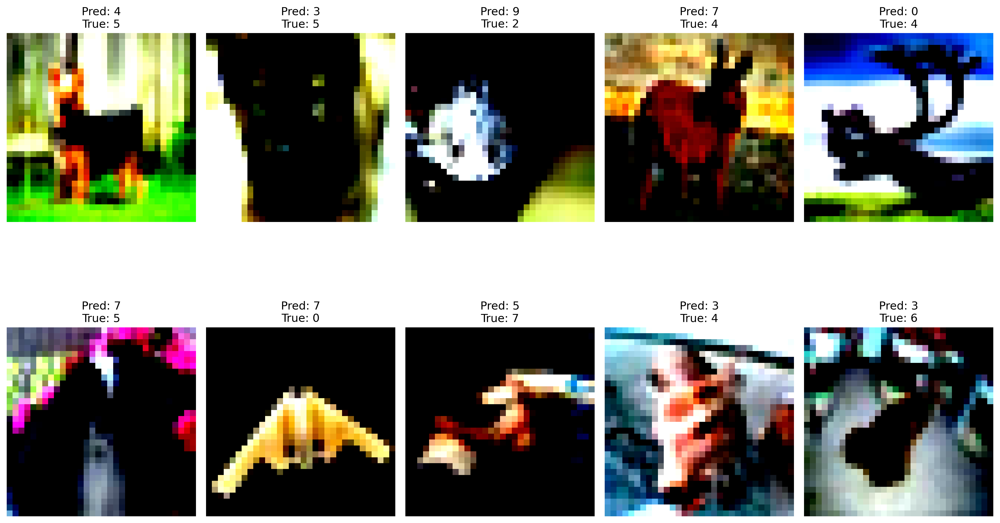

# Deep Learning CNN Regularization on CIFAR-10

A comprehensive exploration of Convolutional Neural Network architectures and regularization techniques for image classification on the CIFAR-10 dataset. This project systematically compares different CNN depths, optimization strategies, and regularization methods to achieve robust classification performance.

## Table of Contents
- [Overview](#overview)
- [Features](#features)
- [Dataset](#dataset)
- [Installation](#installation)
- [Usage](#usage)
- [Project Structure](#project-structure)
- [Model Architectures](#model-architectures)
- [Results](#results)
- [Technologies Used](#technologies-used)
- [Runtime](#runtime)
- [Future Improvements](#future-improvements)
- [License](#license)

## Overview

This project explores how different architectural choices and training techniques impact CNN performance on image classification tasks. Starting from a simple 2-layer baseline CNN, we progressively add depth, batch normalization, dropout, and optimized training strategies to improve model accuracy and generalization.

**Key Question**: How do depth, regularization, and optimization strategies independently and collectively impact model performance on CIFAR-10?

## Features

- **Multiple CNN Architectures**: Baseline 2-layer, deeper 4-layer, and optimized variants
- **Regularization Techniques**:
  - Batch Normalization for training stability
  - Dropout for preventing overfitting
  - Data augmentation (horizontal flips, Gaussian blur)
- **Optimizer Comparison**: Adam vs. SGD with momentum and learning rate scheduling
- **Comprehensive Evaluation**: Training curves, test accuracy, and error analysis
- **Visual Documentation**: Sample grids, training plots, and misclassification analysis

## Dataset

**CIFAR-10** consists of 60,000 32x32 color images across 10 classes:

| Class | Label |
|-------|-------|
| 0 | Airplane |
| 1 | Automobile |
| 2 | Bird |
| 3 | Cat |
| 4 | Deer |
| 5 | Dog |
| 6 | Frog |
| 7 | Horse |
| 8 | Ship |
| 9 | Truck |

- **Training set**: 50,000 images (40,000 training + 10,000 validation after split)
- **Test set**: 10,000 images

The dataset is automatically downloaded when running the notebook via `tf.keras.datasets.cifar10.load_data()`.



## Installation

### Prerequisites
- Python 3.11+
- Virtual environment (recommended)

### Platform-Specific Setup

#### macOS (Apple Silicon)
```bash
# Clone the repository
git clone https://github.com/yourusername/deep-learning-cnn-regularization-cifar10.git
cd deep-learning-cnn-regularization-cifar10

# Create and activate virtual environment
python3 -m venv venv
source venv/bin/activate

# Install dependencies
pip install --upgrade pip
pip install -r requirements-macos.txt
```

#### Windows/Linux (CPU)
```bash
# Clone the repository
git clone https://github.com/yourusername/deep-learning-cnn-regularization-cifar10.git
cd deep-learning-cnn-regularization-cifar10

# Create and activate virtual environment
python -m venv venv
source venv/bin/activate  # On Windows: venv\Scripts\activate

# Install dependencies
pip install --upgrade pip
pip install -r requirements-other.txt
```

#### Windows/Linux (NVIDIA GPU)
```bash
# Clone the repository
git clone https://github.com/yourusername/deep-learning-cnn-regularization-cifar10.git
cd deep-learning-cnn-regularization-cifar10

# Create and activate virtual environment
python -m venv venv
source venv/bin/activate  # On Windows: venv\Scripts\activate

# Install dependencies
pip install --upgrade pip
pip install -r requirements-nvidiagpu.txt
```

**Note**: NVIDIA GPU setup requires [CUDA Toolkit and cuDNN](https://www.tensorflow.org/install/pip#hardware_requirements) to be installed separately.

### GPU Verification

After installation, verify GPU acceleration is working:

```python
import tensorflow as tf
print("TensorFlow version:", tf.__version__)
print("GPU devices:", tf.config.list_physical_devices('GPU'))
print("Number of GPUs:", len(tf.config.list_physical_devices('GPU')))
```

**Expected Output**:
- **macOS (Apple Silicon)**: `[PhysicalDevice(name='/physical_device:GPU:0', device_type='GPU')]` - Uses Metal API
- **NVIDIA GPU**: `[PhysicalDevice(name='/physical_device:GPU:0', device_type='GPU')]` - Uses CUDA
- **CPU Only**: `[]` - No GPU detected

The first code cell in the notebook includes this verification step.

### Dependencies
- **TensorFlow**: 2.16.2 (tensorflow-macos for Apple Silicon, standard tensorflow for others)
- **NumPy**: 1.26.4
- **Matplotlib**: 3.10.8
- **Pandas**: 2.3.3
- **Scikit-learn**: 1.8.0
- **Jupyter**: Latest

## Usage

1. **Launch Jupyter Notebook**:
   ```bash
   jupyter notebook
   ```

2. **Open the notebook**:
   ```
   cnn_regularization_cifar10.ipynb
   ```

3. **Run all cells** sequentially or use "Run All" from the menu

4. **Generated outputs** will be saved in the `assets/` folder:
   - `cifar10_samples.png` - Dataset visualization
   - `best_model_accuracy.png` - Training accuracy curves
   - `best_model_loss.png` - Training loss curves
   - `misclassified_samples.png` - Error analysis
   - `confusion_matrix.png` - Confusion matrix heatmap

## Project Structure

```
deep-learning-cnn-regularization-cifar10/
├── cnn_regularization_cifar10.ipynb  # Main notebook with all experiments
├── README.md                         # Project documentation
├── requirements.txt             # Core dependencies
├── requirements-macos.txt       # macOS-specific (Apple Silicon)
├── requirements-other.txt       # Windows/Linux dependencies
├── .gitignore                   # Git ignore rules
├── assets/                      # Generated visualizations
│   ├── cifar10_samples.png
│   ├── best_model_accuracy.png
│   ├── best_model_loss.png
│   └── misclassified_samples.png
│   └── confusion_matrix.png
└── cifar-10-batches-py/        # Auto-downloaded dataset (gitignored)
```

## Model Architectures

### 1. Baseline CNN (2-Layer)
- 2 Conv2D layers (32 filters, 3x3 kernels)
- Max pooling after each convolution
- Dense layer (512 units) + Output layer (10 units)
- **Optimizer**: Adam

### 2. Deeper CNN (4-Layer)
- 4 Conv2D layers (32, 32, 64, 64 filters, 3x3 kernels)
- Max pooling after each convolution
- Dense layer (512 units) + Output layer (10 units)
- **Optimizer**: Adam

### 3. Batch Normalization Model
- Same 4-layer architecture as above
- Batch Normalization after every Conv2D and Dense layer
- Activation functions applied after BatchNorm
- **Optimizer**: Adam

### 4. SGD with Momentum
- Batch Normalization architecture
- **Optimizer**: SGD (momentum=0.9, lr=0.01)
- Learning rate scheduling (ReduceLROnPlateau)

### 5. Dropout Regularization
- Batch Normalization + SGD architecture
- Dropout (rate=0.5) after fully connected layers
- **Optimizer**: SGD with momentum

### 6. Final Optimized Model
- Variable kernel sizes (5x5 in first layer, 3x3 in subsequent layers)
- Batch Normalization throughout
- Dropout regularization
- Data augmentation (horizontal flips, Gaussian blur)
- **Optimizer**: SGD with momentum and adaptive learning rate

## Results

### Training Performance
The final optimized model demonstrates stable convergence with effective regularization:




### Error Analysis
Misclassified samples reveal common confusion patterns between visually similar classes (e.g., cats vs. dogs, trucks vs. automobiles):



#### Confusion Matrix

The confusion matrix provides a class-by-class view of where the model makes mistakes.


#### Most Common Misclassifications (Largest → Smallest)

| Rank | True → Predicted | Errors | % of True Class |
|---:|---|---:|---:|
| 1 | Cat → Dog | 156 | 15.6% |
| 2 | Dog → Cat | 155 | 15.5% |
| 3 | Bird → Deer | 74 | 7.4% |
| 4 | Truck → Automobile | 63 | 6.3% |
| 5 | Automobile → Truck | 61 | 6.1% |
| 6 | Deer → Horse | 59 | 5.9% |
| 7 | Horse → Dog | 48 | 4.8% |
| 8 | Airplane → Ship | 46 | 4.6% |
| 9 | Ship → Airplane | 45 | 4.5% |
| 10 | Frog → Cat | 44 | 4.4% |

#### Insights

- **Cat ↔ Dog (expected)**: These classes share similar textures/shapes at 32×32 resolution, so mutual confusion is a common and expected failure mode.
- **Truck → Automobile (expected)**: Both are road vehicles with similar silhouettes; this pair is also commonly confused.
- **Bird → Deer (unexpected relative to vehicles)**: This suggests the model sometimes relies on background/scene cues (e.g., outdoor settings) rather than class-defining features. The confusion matrix also shows non-trivial **Bird → Frog** errors, reinforcing that some “nature” classes can overlap in appearance at low resolution.
- **Airplane ↔ Ship**: Another plausible pair where global shape + background (sky/water) can drive mistakes.

### Key Findings
- **Depth**: Adding convolutional layers improved feature extraction
- **Batch Normalization**: Significantly stabilized training and improved convergence speed
- **Dropout**: Reduced overfitting, improving test generalization
- **SGD vs Adam**: SGD with momentum achieved comparable results with proper learning rate scheduling
- **Data Augmentation**: Random flips and blur improved robustness to variations

## Technologies Used

- **Python 3.11**: Core programming language
- **TensorFlow/Keras 2.16.2**: Deep learning framework
- **NumPy**: Numerical computing
- **Matplotlib**: Visualization
- **Scikit-learn**: Data splitting and metrics
- **Jupyter Notebook**: Interactive development environment

**Hardware Optimization**:
- **Apple Silicon (M1/M2/M3/M4)**: Uses `tensorflow-macos` and `tensorflow-metal` for GPU acceleration via Metal API. M-series chips have integrated GPUs (8-16 cores depending on model) that provide significant acceleration over CPU-only training.
- **NVIDIA GPUs**: Standard TensorFlow with CUDA support (`tensorflow[and-cuda]`). Requires separate CUDA Toolkit installation.
- **CPU**: Fully compatible with standard TensorFlow but significantly slower training times.

## Runtime

**Full notebook execution time** (estimated):

| Hardware | Approximate Time |
|----------|-----------------|
| Apple Silicon (M4) with Metal GPU | ~50 minutes |
| NVIDIA GPU (3070ti) | __ minutes |
will update with NVIDIA gpu runtime after testing
**Note**: Epochs are set to 10 for faster experimentation. For full training (100 epochs), multiply times by ~10.

**Quick Testing**: To reduce runtime, modify `epochs=10` to `epochs=5` in training cells.

## Future Improvements

- Implement residual connections (ResNet-style architecture)
- Add more sophisticated data augmentation (Cutout, MixUp, CutMix)
- Experiment with learning rate warm-up schedules
- Test advanced optimizers (AdamW, RAdam)
- Implement model ensembling for improved accuracy
- Add per-class precision/recall/F1 and per-class accuracy reporting
- Consider label smoothing and/or focal loss to reduce overconfident confusions
- Try higher input resolution or lightweight attention (e.g., SE blocks) to better separate fine-grained pairs like cat vs. dog
- Try transfer learning from pre-trained models (EfficientNet, Vision Transformer)
- Implement gradient accumulation for larger effective batch sizes

## License

This project is open source and available under the MIT License.

---

**Acknowledgments**: This project was developed as part of the University of Waterloo's STAT 940: Deep Learning coursework, exploring fundamental concepts in deep learning and convolutional neural networks.